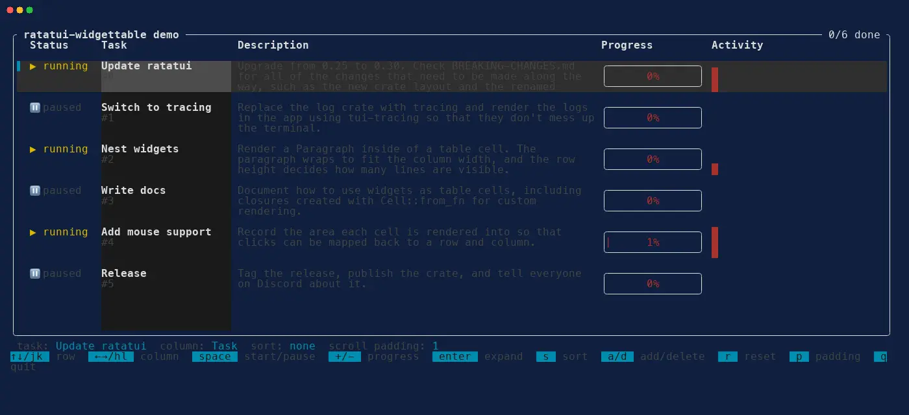

# ratatui-widgettable

[](https://crates.io/crates/ratatui-widgettable)
[](https://docs.rs/ratatui-widgettable)
[](LICENSE)

A [Ratatui] table widget whose cells can contain **any widget**, not just text.

Ratatui's built-in `Table` only supports `Text` in its cells. This crate provides a `Table` with the
same API and rendering behavior, where each `Cell` can hold a `Paragraph` (e.g. with wrapping), a
`Block`, a `Gauge`, a `List`, a `Chart`, another `Table`, or any other widget.



## Installation

```shell
cargo add ratatui-widgettable
```

## Usage

```rust
use ratatui::layout::Constraint;
use ratatui::widgets::{Block, Gauge, Paragraph, Wrap};
use ratatui_widgettable::{Cell, Row, Table};

let rows = [
    Row::new(vec![
        Cell::from("Build"),
        Cell::new(
            Paragraph::new("Compiling a very long list of crates, this might take a while")
                .wrap(Wrap { trim: true }),
        ),
        Cell::new(Gauge::default().percent(42)),
    ])
    .height(3),
];
let widths = [Constraint::Length(8), Constraint::Fill(1), Constraint::Length(20)];
let table = Table::new(rows, widths)
    .header(Row::new(vec!["Step", "Details", "Progress"]))
    .block(Block::bordered().title("Jobs"));
```

## Demo

Run the interactive demo shown above with `cargo run --example demo`. It shows a live task list
with wrapped paragraphs, gauges and sparklines in the cells:

| Key | Action |
| --- | --- |
| `↑`/`↓`, `j`/`k`, `g`/`G` | Select a row, or the first/last row |
| `←`/`→`, `h`/`l` | Select a column |
| `space` | Start or pause the selected task |
| `+`/`-` | Change the progress of the selected task |
| `enter` | Expand or collapse the selected row |
| `s` | Sort by the selected column (press again to reverse) |
| `a`/`d`/`r` | Add, delete, or reset a task |
| `p` | Cycle the scroll padding |
| `q` | Quit |

You can also scroll with the mouse, click a cell to select it, and click a header to sort by that
column. The mouse support is built with `Cell::from_fn`, which records where each cell was
rendered.

The animation is recorded with [betamax] using `assets/record.sh`.

[betamax]: https://github.com/joshka/betamax

## Migrating from ratatui's `Table`

The API mirrors ratatui's `Table`, `Row` and `Cell`, and reuses ratatui's `TableState` and
`HighlightSpacing`, so your existing state handling keeps working. In most cases, you only need to
change your imports:

```diff
-use ratatui::widgets::{Cell, Row, Table, TableState};
+use ratatui::widgets::TableState;
+use ratatui_widgettable::{Cell, Row, Table};
```

Differences from ratatui's table:

- `Cell::new` takes a widget. To create a cell from a string, use `Cell::from("text")` (anything
  that converts into `Text` still works with `Cell::from` and `Row::new`).
- `Cell::from_fn(|area, buf| ...)` creates a cell from a closure. Use it for widgets that only
  implement `Widget` by value, stateful widgets, or custom drawing.
- `Table`, `Row`, and `Cell` do not implement `Clone`, `PartialEq`, `Eq`, or `Hash` because cells
  hold arbitrary widgets.
- Includes `Table::scroll_padding`, which isn't yet in a released version of ratatui.
- The deprecated `Table::highlight_style` has been left out. Use `row_highlight_style` instead.

As with the built-in table, a row's height is fixed (1 by default). Use `Row::height` to make room
for widgets that need more than one line. Widgets are rendered into the area of the cell and are
clipped to it.

## Supported widgets

`Cell::new` accepts any `W` where `&W: Widget`. All of ratatui's built-in widgets implement
`Widget` for a reference, as do `Text`, `Line`, and `Span`. To support this in your own widgets,
implement `Widget for &MyWidget`.

## Testing

Besides unit tests, the table is fuzzed against ratatui's own `Table` to check that text-only tables
render identically, and with random widget cells to check that nothing panics or draws outside the
table. See [fuzz/README.md](fuzz/README.md), and [docs/fuzzing-findings.md](docs/fuzzing-findings.md)
for the bugs it found.

## Compatibility

- Ratatui 0.30 (`ratatui-core` 0.1 and `ratatui-widgets` 0.3)
- Minimum supported Rust version: 1.88
- `no_std` compatible (requires `alloc`)

## License

MIT. This crate is based on the `Table` widget from [Ratatui], which is also MIT licensed. See
[LICENSE](LICENSE).

[Ratatui]: https://ratatui.rs
